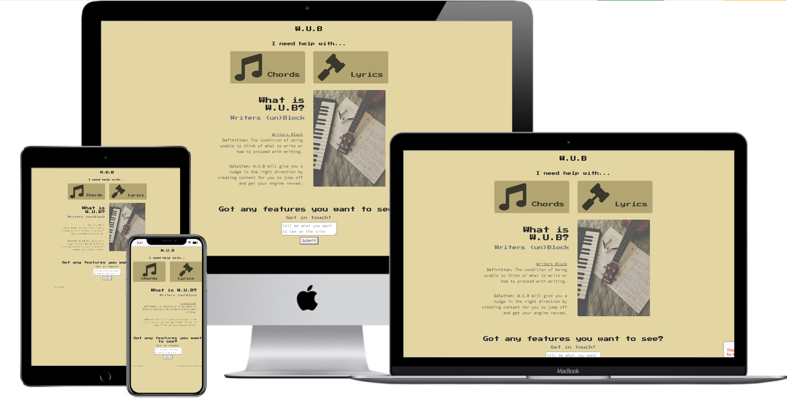
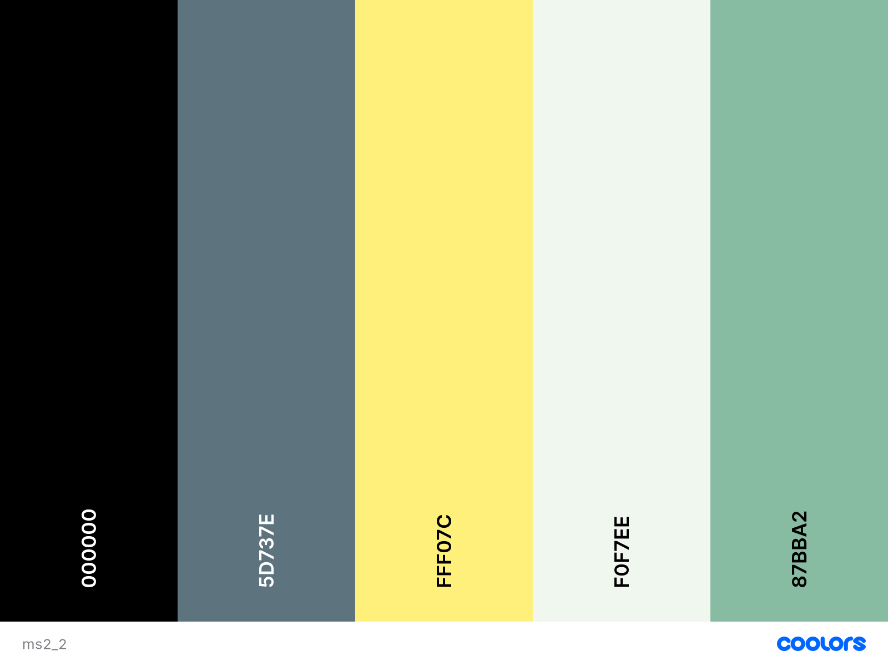
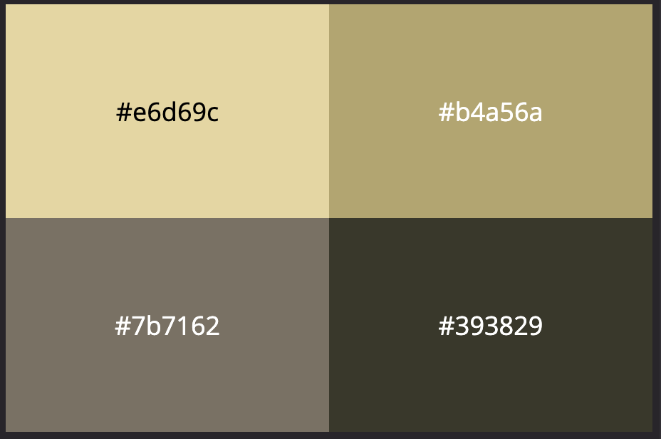
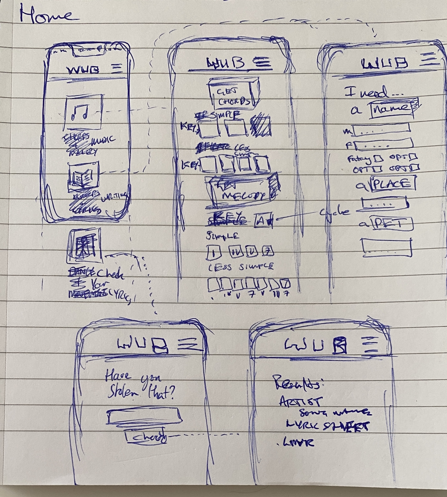
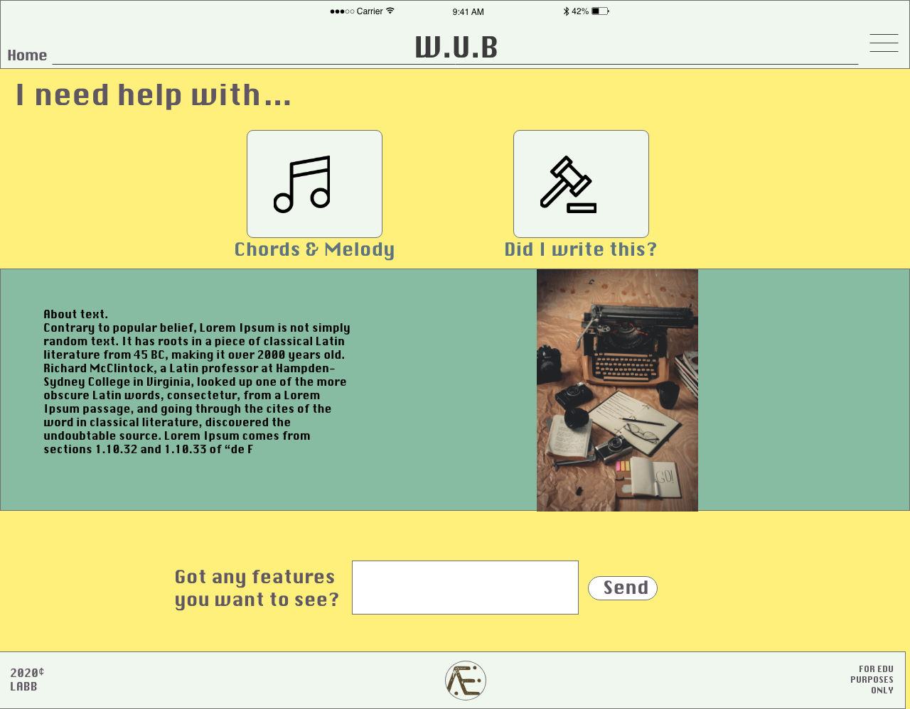
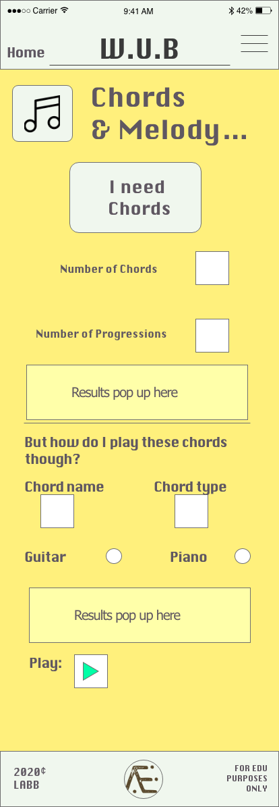
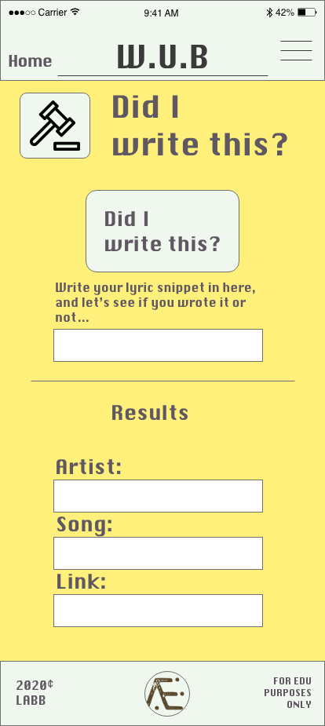
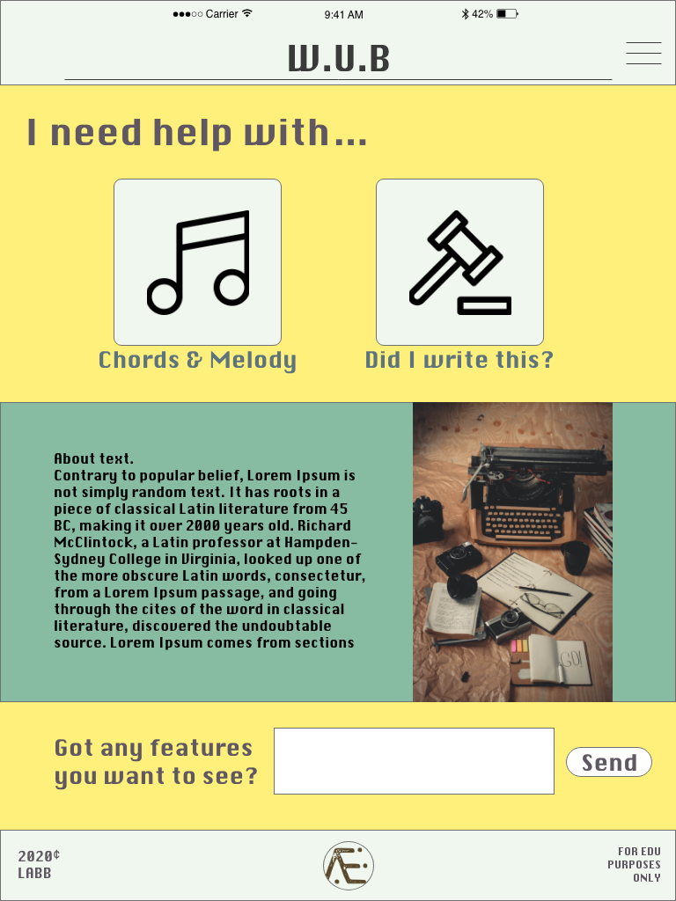
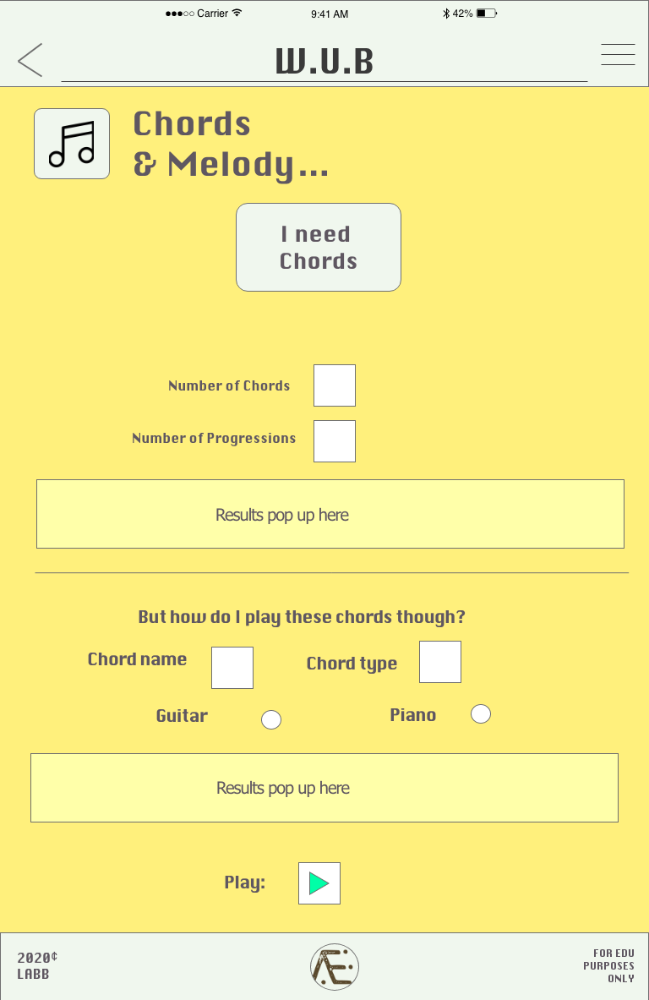
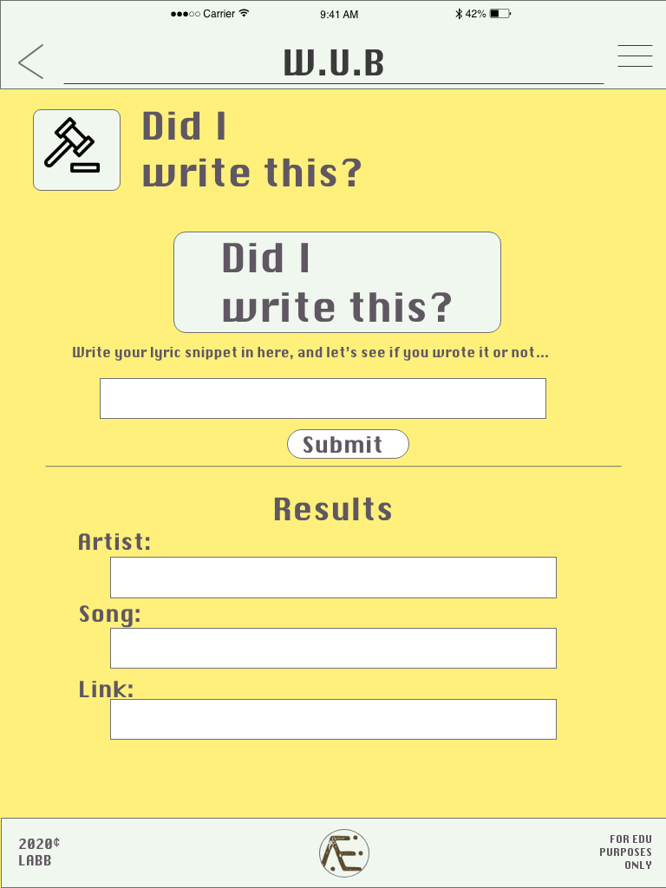

# [W. U. B (Writers UnBlocker)](#w-u-b--writers-unblocker-)



W. U. B is a one stop shop for creatives to get a quick rev on their accelerator pedal. Current features include an instant chord sequence generator, how-to-play chord diagrams on guitar & piano, and a lyric search feature. If you have any questions, comments or bugs, please let me know and get in touch :).

- [UX](#ux)
  - [Project Goals](#project-goals)
  - [Target Audience Goals](#target-audience-goals)
    - [Target audience](#target-audience)
    - [User Goals](#user-goals)
    - [User Stories](#user-stories)
      - [Mr. Bloggs](#mr-bloggs)
      - [Ms. C. Thweepioh](#ms-c-thweepioh)
      - [They Maplecourt](#they-maplecourt)
    - [Site Owner Goals](#site-owner-goals)
- [User Requirements and Expectations](#user-requirements-and-expectations)
  - [User Requirements](#user-requirements)
  - [User Expectations](#user-expectations)
- [Design Choices](#design-choices)
  - [Fonts](#fonts)
  - [Icons](#icons)
  - [Colours](#colours)
- [Wireframes](#wireframes)
  - [Original Concept](#original-concept)
  - [Desktop](#desktop)
  - [Mobile](#mobile)
  - [Tablet](#tablet)
- [Features](#features)
- [Features That Will Be Implemented In The Future](#features-that-will-be-implemented-in-the-future)
- [Technologies Used](#technologies-used)
  - [Languages](#languages)
  - [Libraries & Frameworks](#libraries---frameworks)
  - [Tools](#tools)
- [Testing](#testing)
  - [Test Planning](#test-planning)
  - [Testing Stories](#testing-stories)
  - [Overall](#overall)
- [Bugs](#bugs)
  - [EmailJs JS impliment Bug](#emailjs-js-impliment-bug)
  - [Rapid API SDK issue](#rapid-api-sdk-issue)
  - [Chord chart call](#chord-chart-call)
- [Deployment](#deployment)
  - [Running W.U.B Locally](#running-wub-locally)
- [Credits](#credits)
  - [Media](#media)
  - [Acknowledgements](#acknowledgements)

## UX

### Project Goals

Writers Unblock is designed to give an artist a little push through barriers that they commonly face. The goal is to provide a **non-nonsense**, almost **instant injection of creativity**, or reassurance. It is designed to be **easily usable** and readable.

### Target Audience Goals

#### Target audience

- Music **writers**
- Music **composers**

#### User Goals

- A website that can be **operated by a guitarist** with a guitar in **one hand**, and a plectrum coiled in the other, with only **one finger available** for tapping.

- Simple and complicated **chord sequence generators**.
- **Direct contact** for feature requests.
- **No frills**, easy to navigate design.
- **Easily recognisable** on all browser sizes.

#### User Stories

##### Mr. Bloggs

"_**As a composer and pianist** I expect a site that can **generate harmony**, in key, instantly, and flexibly._"

##### Ms. C. Thweepioh

"_**As a musician and web developer**, I want the ability to **get in touch** with the developer and suggest feaures, potentially to collaborate and let them know of nay bugs or improvements._"

##### They Maplecourt

"_**As a lyricist**, I make lyrics all day, every day of the week. Sometimes I need to **make sure that what I make is mine**, without sifting through unrelated search results._"

#### Site Owner Goals

- Provide **results easily** and effortlessly to writers.
- Maintain a level of **theoretical stability** in the generation of musical chords and melody.
- **Not to collect**, or try to claim, any ownership, credit, **contact details** or watermarking of content provided to any final product that emerges from the results generated on the site.

## User Requirements and Expectations

### User Requirements

- **Easy buttons** to sections.
- **Familiar navbar** as to not get lost or confused about where they are.
- **Instant** and varied **results** from each generation
- Only **song lyrics** to be searched and returned in lyric search.

### User Expectations

- **Varied** enough **results** every time, so if initial generation result is not satisfactory, the next one should not appear familiar to its predecessor.
- Text bars are **copy and paste friendly**
- Site should be **accessable on all browsers** from mobile to desktop.
- Any feature suggestions to go **direct to developer**.

## Design Choices

This is purely functional web application, design is feature focused, and style comes second. I went for a relatively light background to keep the focus on the darker content. Large active buttons used for generation of content.

### Fonts

The font used in the wireframes is called [Krungthep](http://fonts3.com/fonts/k/Krungthep.html) which looks as mechanical as possible without appearing too comical or ironic. Which goes with the purely functional theme I'm applying site-wide. The focus is to provide short, highly literal, informative information to the user so as to **not distract** from what's important - the content generation.

Implimentation of this font proved too difficult for loading so a new and similar font was chosen on the same merits from **Google Fonts** called [**Press Start 2P**](https://fonts.google.com/specimen/Press+Start+2P?category=Display,Monospace&preview.size=64&preview.layout=row&selection.family=Press+Start+2P|Roboto+Slab&sidebar.open#pairings") and **Roboto** for minor text.

### Icons

Icons, much in the same way as the font, were designed to be as transparent as possible. I got the fonts, initially from [FlatIcon](https://www.flaticon.com/home) and then later from [Font Awesome](https://fontawesome.com/) both for free.

### Colours

Originally, t colour palette was generated at [**Coolors.co**](https://www.coolors.co). I auto generated a palette, freezing certain tones that felt right until a strong contrasting palette was finished. Something striking and not too distracting. These were the colours used for the wireframes and VER 1 of the site.

- **Primary Green** - #87BBA2 - This muted green is used for buttons that activate or do things. All the generate buttons have this colour.
- **Background Yellow** - #FFF07C - This muted yellow is used to keep the focus on the generation buttons. The theory behind it that green is go and yellow is slow-down. I found that the focus is drawn to the green off the yellow much easier than any other colour I tried.
- **Teriary Pearl/Cream** - #F0F70E - I used this off white in the headers and the footers to prive a clear background for navigatiopnal information without distraction.
- **Grey and Black** - #000000 & #5D737E - These darker colours are used for text, icons and and results.

The original palette:



## Current Colour Palette

After testing the original yellow and green contrast was too harsh and tiring to the eyes. Considering the text design and simple approach, I search for a soft retro GameBoy palette instead with only 4 different, complimentary tones. On reflection, I should have done wireframes without colour for situations like this.



## Wireframes

### Original Concept



### Desktop



### Mobile





### Tablet





## Features

- **2 easy to navigate features** on home page.
- **One page** for all content, Javascript hides other content when certain features are selected.
- **Music harmony** random generator.
- **Direct contact with developer**, with no data collection.
- **Captcha** for stopping spam or bots from abusing the mail feature.
- **Lyric search**, with dedicated, filtered results straight to music from a respectable music search source.

## Features That Will Be Implemented In The **Future**

- **How to play chord diagrams and audio clips** Originally, until the rebuild of the site, the 'How to Play' section was underneath the chord generation section. I plan to re-impliment this section at the earliest possible point, with an **Auto fill** feature from the chord generator. So only one button is needed to generate all the content.

- **Features for writers, novelists, or games masters** with a pen in one hand and their phone / tablet in the other - to generate names of a wide array of things from names, pets and places, to orcs, dragons and angels.

- Simple and complicated, in key, **melody generator**.

- Link footer to personal site / git hub repo.

- Use **8-bit icons** for in theme visuals.

- More **interactive visual transitions** between javascript toggles.

## Technologies Used

### Languages

- [HTML](https://developer.mozilla.org/en-US/docs/Web/HTML)
- [CSS](https://developer.mozilla.org/en-US/docs/Glossary/CSS)
- [JavaScript](https://developer.mozilla.org/en-US/docs/Glossary/JavaScript) is used to generate chords, hide DOM elements and call APIs on this project.
- [JQuery](https://jquery.com) is used to simplify DOM manipulation.

### Libraries & Frameworks

- [Bootstrap](https://getbootstrap.com/)
- [Git](https://git-scm.com/)
- [Google Fonts](https://fonts.google.com/)
- [Font Awesome](https://fontawesome.com/)
- [EmailJS API](https://www.emailjs.com/)
- [Google Cloud Platform](https://cloud.google.com/) - for captcha on EmailJs.
- [Shazam API](https://rapidapi.com/apidojo/api/shazam) - provided lyric search results via it's api.
- [Scraggo Music Tools](http://www.scraggo.com/) - javascript chord generation.
- [Loading IO](https://loading.io/) - animated gif loading image.
- [Quokka.js](https://quokkajs.com/) - for live JS testing.
- [JShint](https://jshint.com/) - for linting my Javascript.s
- [PopperJs](https://popper.js.org/)

### Tools

- [Adobe XD](https://www.adobe.com/uk/products/xd.html) was used to create interactive wireframes, giving the ability to live-test on all platforms.
- [VS Code](https://code.visualstudio.com/)
- [Chrome](https://www.google.com/intl/en/chrome/) developer tools.

## Testing

### Test Planning

This was my **first time implimenting API's and using Javascript** in a project, so testing was done at almost every line of code, using console logs and chrome inspector. As features were implimented, testing was then carried out by a small select batch of users and peers. Each tester was **asked to test feature by feature**.

### Testing Stories

- The first test on the EmailJS integration came back with a **problem with the submit button**, where only a small section of the button was clickable to submit. This was **fixed with a more robust structure to the HTML** of that section.

- Similiarly, the testing of the lyric search feature showed an issue with the results link button and **only showed results pertaining to MAC MILLER**, a recording artist. This was fixed with finessing the Javascript that passed the search term into the URL.

- Most testing of the **search** feature came back with feedback saying the feature **was not returning any results**. On further inspection, the results were **loading too slowly**. To fix this, I trimmed some un-need headers being sent to via fetch and added a loading icon to appear after the user presses search, until the results are returned.

- Another loading issue found during testing of the deployed site, was the **loading of the image** on the about section. Most browsers never loaded the file. this was fixed by **reducing the file size** and refining the relative load path in the CSS file.

- There was a **entire rebuild** of the site from scratch after I initially thought it was finished. After sending out this version to testers feedback on the code showed that the bootstrap structure and spahetti nature of the code deemed it worth of an **entire rebuild**. I believe version 2, the current build, **is much better** and the rebuild was defintely worth it.

### Overall

#### Responsiveness

- **Plan** - The site had to desgned as a mobile first platform to maintain the one handed minimal tap feature.
- **Implimentation** - I kept the preview in mobile view as to allow me to make the best decions when styling.
- **Result** - The site's main features can be navigated to and used with minimal taps and instant results.
- **Verdict** - The site looks and feels great on mobile browsers.

#### Design

- **Plan** - Feature first, one handed use, minimal interaction to use features.
- **Implimentation** - Big buttons and less than 3 taps to get results.
- **Results** - After some testing, this was reduced to two taps generate the main feature of the site, the chords. with 3 for the rest.
- **Verdict** - Passed these tests. Very happy with the no nonsense approach of the site.

## Bugs

Throughout development of the site I had a live deployment and a local preview of the project in chrome with developer inspector open on each tab. So most bugs were squashed during the build. However there were some issues worth mentioning.

### EmailJs JS impliment Bug

- **Bug** EmailJs send would trigger on each page refresh, twice, without content.
- **Fix** Moving the JS function code within it's own '{}' curly brackets as a function fixed the problem.
- **Verdict** Changing the scope of the variables used in the JS code for EmailJs fixed the problem, thank you to fellow pupil Chris Palmer for helping me with that.

### Rapid API SDK issue

- **Bug** Lyric search feature was firing but not returning the correct data from the API.
- **Fix** Code Institute tutors located and found the probelm was with the Rapid API SDK sample code, providing incorrect headers and JSON code.
- **Verdict** I wouldn't have known it at the time, but experience will have helped to spot this myself.

### Mac Miller saerch results bug

- **Bug** At some point the Lyric Search results were coming back solely as Mac Miller.
- **Fix** The javascript code that passed the search value to the url to be put into the HTML element, had the wrong formatting of the template literal, so once that was fixed, it was working again.
- **Verdict** I should have used GIT to roll back / find an example of the code working before it had started returnign this error, as it was clearly a human error - I must have deleted a character at some point to make this happen. However, I chose instead to meticulously comb the code until I found the error, this was more due to a desire to learn, rather than rely on technology to fix somethign quickly.

### Chord chart call

- **Bug** When trying to impliment the Scales-Chords-Api to insert 'how to play' chord images, I found that their documentation was aimed at **static sites**. Their call to their api was in the form of a custom tag **"< ins >"** which only called on a page load, when the HTML was read.
- **Fix** I **connected with another programmer** called Bim Williams, who, as a musician, was interested in this idea anyway. He dove deeper than I was able to, into their api call and helped to show me how to break down the code that is called, so i could call it when I needed.
- **Verdict** Once again, experience was the key here. Very glad I was showed how to do this! However the technology was too old to impliment with the level of stability I want on my site. So, I have had to remove this particular API for now, while I search for a more modern iteration of the idea.

## Deployment

**W.U.B** was developed on **VS Code**, using **git** and **GitHub** to host the repository.

When deploying **W.U.B** using **GitHub Pages** the following steps were made:

- Opened up **GitHub** in the browser.
- Signed in using username and password.
- Selected my **repositories**.
- Navigated to **'/lornebb/W.U.B'**.
- In the top navigation clicked **'settings'**.
- Scrolled down to the **GitHub Pages** area.
- Selected **'Master Branch'** from the **'Source'** dropdown menu.
- Clicked to confirm my selection.
- W.U.B now live on GitHub Pages.

### Running W.U.B Locally

Cloning **W.U.B** from **GitHub**:

- Navigate to **'/lornebb/W.U.B'**.
- Click the green **'Clone or Download'** button in the top right.
- Copy the **url** in the dropdown box.
- Using your favourite **IDE** open up your preferred **terminal**.
- Navigate to your desired file location.
- Copy the following **code** and input it into your terminal to clone Holiday Destinations.

```bash
git clone https://github.com/lornebb/W.U.B.git
```

## Credits

- [**Chris Palmer**](https://github.com/cgpalmer) - helped with JavaScript and API integration troubleshooting.
- [**David Williams**](https://eightarms.co.uk/) - helped navigate some API documentation suggestions.
- **CI Student care** - helped with incomplete SDK from API.
- [Bootstrap snippets](https://bootsnipp.com/snippets/GqBjl) **dvinciguerra** for the Square Buttons.
- [**Bim Williams**](https://github.com/MrBim) - Cracked the Scales-Chords-Api call problem by deep diving into their api!
- [WildLeoKnight](https://lospec.com/palette-list/muddysand) - Gameboy colour palette created by WildLeoKnight.
- [Simen Daehlin](https://github.com/Eventyret) - my mentor during this build, provided above and beyond help to teach me how to make it reach a standard I could be proud of.

### Media

- The photos used in this site were obtained from **FREEPIK** via FlatIcon.com for icons in wireframes, and the photo is by **Wallace Chuck** from **Pexels**.

### Acknowledgements

- I received inspiration for this project from my brother, who just happened to ask the right question at the right time, as always.
